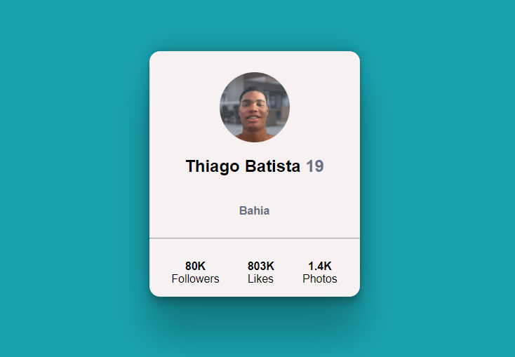

# Meu primero desafio fazendo sozinho

Esse e meu primero projeto sozinho testando meus conhecimentos com HTML5 e CSS3. Utilizei tudo que eu aprende ao longo desses meses estudando essa duas linguagns de marcação e estilização. 

O projeto e um catão com informações propostas pelo o desafio.

Esse e o resultado final 🚀

## Tecnologias utilizadas
- HTML
- Css